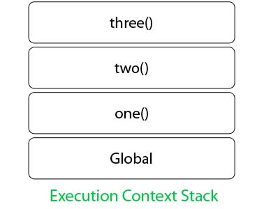

[本文来自](http://davidshariff.com/blog/javascript-scope-chain-and-closures/)

# 标识符解析与闭包

每个执行上下文的作用域链属性只是当前上下文的变量对象 和 所有父的词法(lexical)变量对象的集合。

Scope = VO + All Parent VOs

Eg:	scopeChain = [ [VO] + [VO1] + [VO2] + [VO n+1]];

## 确定作用域链上的变量对象

我们已经知道作用域链上的第一个变量对象是属于当前执行环境的， 我们也可以通过查找 父级上下文的作用域链 来查找 剩下的父级的变量对象。

```
function one() {
	
	two();

	function two() {
		
		three();

		function three() {
			alert('I am at function three');
		}
	}
}
one();
```



上面的那张图片显示，当执行到function three时候，作用域看起来像下面这样：

```
three() Scope Chain = [ [three() VO] + [two() VO] + [one() VO] + [Global VO]];
```

**这里是重点：JavaScript的解析器使用的是词法(静态的)作用域，它和动态作用域是相反的。**

[词法作用域与动态作用域的区别](https://www.zhihu.com/question/20032419)

简单的说： 

* 词法作用域(静态作用域)是在**书写**代码时或者说定义时就确定了, 而动态作用域是在**运行时**确定的。

* 词法作用域关注在何处声明，而动态作用域关注函数从何处调用，其作用域是基于运行时的调用栈的。

对于上面那个例子，three()将永远被静态绑定在two()， 这反过来two()永远被绑定在one()中，依次类推，这就有了链接的效果，其中，所有内部函数可以通过静态绑定的作用域链来访问外部函数的变量对象。

这就说为什么说"函数的作用域是在定义时确定的，而不是调用时。"


